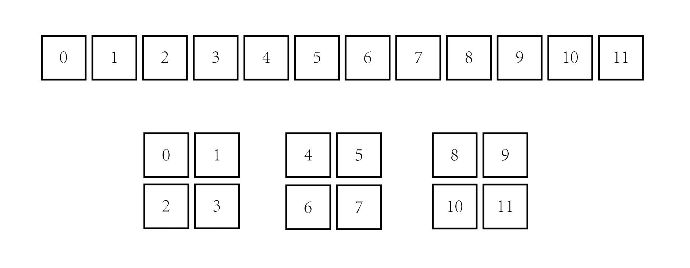

&emsp;
# 3 多维数组

>多维数组的声明
```cpp
type array[dim1][dim2][...]
```
- 多维数组只是一个抽象的概念，因为我们只需要把各个索引的乘积放入一个简单的数组中就可以获得同样的结果

>示例 1
```c++
#include <iostream>
using namespace std;

int main()
{
    // 数组维度：dim[d1][d2][d3]
    // 数组索引：index[x][y][z] = index[x*(d2*d3) + y*(d2) + d3]

    int a[3][2][2] = {0,1,2,3,4,5,6,7,8,9,10,11};
    cout << a[2][1][1] << endl; // 相当于索引 11 = 2*(2*2) + 1*1 + 1
    return 0;
}
```
>示例 2
```cpp
#include <iostream>
using namespace std;

int main()
{
    int a[3][2][2] = {0,1,2,3,4,5,6,7,8,9,10,11};
    cout << a[0] << endl;
    cout << a[1] << endl; // 偏移16个字节，也就是第1块开始的位置

    cout << a[0][0] << endl;
    cout << a[0][1] << endl; // 偏移 8 个字节，也就是每行开始的位置

    // 多维数组的索引是每个维度对应的首地址，偏移量是后面维度的乘积
    // 想按单个元素索引，需要将其转成 int* (4个字节偏移量)
    int* p = (int*)a;     
    cout << p[0] << endl;
    cout << p[10] << endl;

    return 0;
}
```



